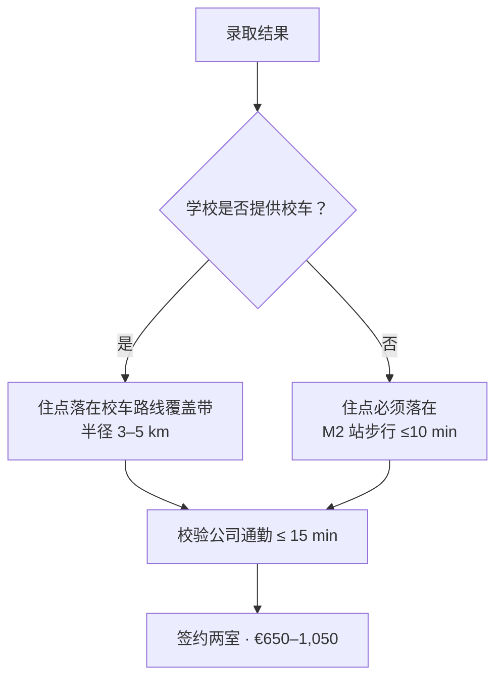

# 海外派遣与子女教育综合规划（2027–2030）

> **对象**：T 公司（某中资通信设备企业）软件工程师，2027 年初外派罗马尼亚布加勒斯特，工期 3 年；配偶全职随行，6 岁女儿随行。
> **交付**：① 小学就学方案；② 外派收支统筹；③ 教育衔接专项；④ 独立评审意见；⑤ 可行性／收益／风险／应对四维优化。
> **阅读方式**：正文只保留结论与决策框架；全部原始口径、测算表、数据来源统一置于文末 [附录](#附录-a汇率与税务口径)。

:::tip[一页速览]

| 维度 | 结论 |
| --- | --- |
| **学校** | **中档英授国际学校**——首选 **Verita International**，备选 **MISB**（地铁直达）／**Questfield**（校车覆盖）；三年全包 **¥22–33 万**（含学费、一次性费用与校车）。**罗语授课学校不纳入方案** |
| **家庭适应** | 家庭成员零海外经验 → **家长社群与英语支持成为硬指标**：Verita 在 EAL 成熟度、家长社群（约 680 人／33 国籍）、社区国际化三项上均最优；建议**定校前由配偶参加一次校园开放日** |
| **居住** | **随录取校切换**（见 [§2.4](#24-分学校居住方案)）：Verita → Băneasa／Aviației；MISB → Aviatorilor／Piața Victoriei；Questfield → Pipera／Voluntari。两室月租 **€650–1,050** |
| **出行** | **仅限步行 + M2 地铁 + 公交 + 学校校车**，不含自驾；居住点必须落在步行圈、地铁站步行圈或校车路线覆盖带内 |
| **财务** | 月结余 **1.05 万**、年结余 **12.6 万**；**三年结余 37.8–51.8 万元**，随学校与居住方案而定（见 [§3.3](#33-结余测算与六情景)） |
| **红线** | 高端校＋高端两室 → 三年**倒亏 9.8 万**，突破「不额外自费」 |
| **教育侧最大风险** | 回国就读**年级不可确认**——只能用时间解决，钱解决不了 |
| **关键前置** | R1 计税基数确认 · R2 中罗抵免申报 · R3 汇率对冲 · R4 校区与校车确认 · R9 年级预案 |

:::

---

## 1. 场景与约束

| 项目 | 内容 |
| --- | --- |
| 外派地 | 罗马尼亚·布加勒斯特（公司总部位于北部商务区） |
| 周期 | 2027 年初 → 2030 年初（3 年，含 2 个完整学年 + 第 3 学年部分） |
| 本人 | 软件维护方向；工资性收入属敏感项，本文不列示 |
| 配偶 | 全职随行，**不可在当地就业**；承担照料与中文教学 |
| 子女 | 6 岁，2026/27 学年在国内幼儿园大班；赴罗后入读英语教学小学 |
| 回国衔接 | 西安雁南小学（**学籍可保留；就读年级暂无法确认**） |
| 硬约束 | **无教育补贴**；原则「不额外自费」；待遇**均按定额计税发放**；**出行不含自驾** |

### 1.1 「定额计税」的口径

补助及各类补贴均按**定额计税**方式发放：**按固定金额发放、不审核凭证，全额并入计税基数**。这一口径决定了支出侧的优化方向：

| 规则 | 内容 |
| --- | --- |
| 发放方式 | 按固定金额发放，不审核凭证 |
| 房租低于标准时 | 差额归个人所有 |
| 税负 | 全额计税，税后 = 税前 × 80% |
| 支出侧最优策略 | 在保证居住质量的前提下主动压低房租 |

:::tip[由此推出的第一条硬结论]
住房补贴税后固定为 **€1,450 × 80% = €1,160／月**，与实付房租无关。因此：

> **房租每压低 €100，家庭每月净增约 €100（≈ ¥780），三年合计约 ¥2.8 万元。**

这把「省钱」从一句口号变成了可执行的单价——也是本方案把两室租金**控制线设定在 €1,050** 的直接依据。
:::

### 1.2 四条不可动摇的约束

1. **教育无专项补贴** → 学费必须由结余支付，**学校档位是财务结论的第一变量**。
2. **配偶不可就业** → 单一收入来源，无第二现金流缓冲，应急金须前置。
3. **分红不计入测算** → 收入侧只保留工资与津贴，**容错空间主要留给汇率与医疗两项**。
4. **出行不含自驾** → 家庭不购置车辆，出行只使用**步行、M2 地铁、公交与学校校车**。由此取消车辆购置、保险、油费与停车支出，同时**校车费转为固定成本**；更关键的是，**居住点不再以「开车 15 分钟」为宽松标准**，而必须落在步行圈、地铁站步行圈或校车路线覆盖带之内——这是一条比财务约束更硬的边界。

---

## 2. 就学方案（任务一）

### 2.1 定校逻辑：无自驾条件下，先定校、再定房

在不使用私家车的前提下，「住哪里」不是一个可以自由优化的变量，而是**由录取学校的通勤属性反向决定**的。三条可达性规则构成全部推理：

| # | 规则 | 对居住的约束 |
| --- | --- | --- |
| 1 | **学校提供校车** → 住点须落在当年校车路线覆盖带内 | 可放宽至距校 3–5 km，但**路线固定、时间不可自主** |
| 2 | **学校不提供校车** → 住点必须落在 **M2 站步行 ≤10 分钟**，且学校在站点步行圈内 | 选择范围收窄到地铁沿线 |
| 3 | **家长上班点固定**（北部商务区）→ 住点须与公司在同一 M2 段或公交短驳范围内 | 单一通勤半径内须同时容纳「上班」与「上学」 |

布加勒斯特地铁 **M2 线**是唯一贯穿市中心的南北干线，站点自北向南依次为：

**Pipera → Aurel Vlaicu → Aviatorilor → Piața Victoriei → Piața Romană → Universitate**

公司靠北端，Verita 在更北的 Băneasa 一带，MISB 在南端的 Piața Romană 站旁，Questfield 在东北外圈的 Pipera–Voluntari。四所学校分处三个方向，**没有任何一个居住点能同时兼顾全部**——这正是必须按学校分别给出居住方案的原因。

**决策顺序**（先拿到录取结果，再签租约）

**选址四要素权重**：教育质量与衔接 35% ｜ 通勤时间 25% ｜ 教育支出 25% ｜ 安全与居住条件 15%

:::caution[本条对执行节奏的影响]
居住方案随录取结果而定，因此**租房不能早于录取确认**。落地初期以短期公寓过渡 2–4 周，拿到录取后再签约长租——这一顺序必须在出国前写进时间表，否则会出现「先租房、后择校」的倒置，被迫在通勤上长期妥协。
:::

### 2.2 学校梯度：锁定中档英授区间

| 档位 | 代表学校 | 学费（€／年） | 三年全包（¥） | 判定 |
| --- | --- | --- | --- | --- |
| **高端** | AISB、BSB、ISB、IBSB、Cambridge School | 17,000–24,000 | 43–62 万 | ❌ **三年成本 ≈ 全部离家补助总额，与「不额外自费」冲突** |
| **中档（本方案区间）** | **Verita International**、**MISB**、Questfield | 8,050–12,000 | **24–34 万** | ✅ **推荐选择** |
| 罗语授课（公立与私立国立线） | 各国立小学等 | 0–6,500 | 1–20 万 | ❌ **不纳入方案** |

:::caution[为什么高端档必须排除]
以 BSB 为例：小学段 €21,294／年，另需预订金 €5,789 + 入学费 €3,674 + 申请费 €275。三年总投入约 **55–62 万元**，已**超过三年离家补助总额**。在无教育补贴、且分红不计入测算的前提下，选高端校等于用工资结余倒贴，直接违反原则。本方案的学校定位**锁定在中档英授区间**，高端档仅作记录，不进入候选比较。
:::

:::danger[为什么罗语授课学校不纳入方案]
罗语授课学校（含零学费的国立小学与私立校的国立线）唯一的优势是学费，但代价是**三年后既形不成英语能力沉淀，也拿不到可用于回国衔接的英文课程与成绩记录**。对一个三年后必须回到中文公办体系的孩子而言，这个交换是不成立的：省下的学费**不足以补偿语言机会成本与回国评估时的举证劣势**。

需要区分的是「学校授课语言」与「课程体系」：**Questfield 为双语校**，同时开设国际线（英授）与国立线（罗授），本方案只取其**国际线**，申请时必须明确勾选。
:::

### 2.3 中档区间横向对比

三所学校的定位接近，差异集中在**授课语言、校车条件与地铁可达性**三处——恰是本方案最看重的三项：

| 维度 | **Verita International** ⭐ | **Maria International（MISB）** | Questfield School（国际线） |
| --- | --- | --- | --- |
| 课程体系 | 英式（英国国家课程 + IEYC／IPC／IMYC） | 英式（英国国家课程，罗教育部授权） | 英式 + 剑桥元素 |
| 授课语言 | **全英语** | **全英语** | **双语**（国际线英语／国立线罗语） |
| 小学段学费（€／年） | 约 9,000–11,000 | 10,500（Short）／11,500（Long） | 8,050–12,650（公开区间，须校方确认） |
| 一次性费用 | 申请 €50–70 + 注册费 | 注册 €500 + 预订金 €1,500（抵扣学费）+ 材料 €500 | 按校方当年报价 |
| 校区 | Soldat Gheorghe Pripu 22A, Sector 1（Băneasa 北）；另有 Amber Campus 于 Tunari（2026/27 开放，面向 3–10 岁） | Piața Amzei（市中心） | Titu Maiorescu 26, Pipera–Voluntari |
| 学校规模 | 约 630–680 人，班均 18–21，师生比 1:10 | **小型**（班均约 8 人） | 全校约 250 人，社区型 |
| EAL／英语支持 | **成熟**（A1–A2 起，Year 2 以上；配 Student Support Team 与个别教育计划机制） | 有（小班化，个体关注度高） | 有 |
| **班额与个体关注** | 班均 18–21，师生比 1:10 | **班均约 8（三校最优）** | 班均较小 |
| **家长社群成熟度** | **高**（约 680 人、33 国籍、国际生占 40%） | **低**（规模小，同侪家庭少） | 中（约 250 人，处国际社区带） |
| **校内罗语接触** | 有（Primary 起开设罗语课） | 有限 | **多**（双语校园环境） |
| **周边社区国际化** | 高（Băneasa 国际社区带） | 低（市中心本地化程度高） | 高（Iancu Nicolae 国际社区带） |
| **校车服务** | ✅ **提供**（按路线年度定价，约 €1,000–1,500／年） | ❌ **不提供** | ✅ **提供**（按路线定价） |
| 地铁可达性 | M2 Aurel Vlaicu 站 + 公交短驳 | ✅ **M2 Piața Romană 站 + 步行约 400 m** | ❌ 无地铁直达，**依赖校车** |
| 与国内公办课程差异 | 较小（英式进度差异可控） | 较小（英式） | 较小（英式） |
| **综合推荐** | **★★★ 首选** | ★★☆ 备选（地铁直达） | ★★☆ 备选（校车覆盖） |

**推荐 Verita 的三条理由**

1. **校车 ＋ 北部区位，与公司共用一条动线**——Verita 是唯一同时满足「提供校车」与「与公司同处北部」的候选校，家庭只需维护一条日常动线，接送与上班不互相拉扯。
2. **全英语环境，无语言掺杂**——三校中唯一既全英授课、又配备成熟 EAL 支持体系的学校，对零基础的 6 岁孩子衔接最友好。
3. **非营利基金会 + Dukes Education 集团背书**——治理结构与师资稳定性较强，三年周期内不易出现办学波动。

**MISB 与 Questfield 的价值**

- **MISB**：三校中唯一**地铁直达**的学校（M2 Piața Romană 站 + 步行 400 m），在全城公交可靠性有限的条件下，这是最不受路况影响的通道；代价是**无校车**，家长须每日两趟陪同。
- **Questfield**：**校车覆盖 + 租金最低**（Pipera–Voluntari 一带两室 €650–850），是财务上最省的路径；代价是学校为双语校且位置偏东北外圈，**若未提供覆盖所选小区的校车路线即不可行**。

三校构成「**首选 + 两条各具优势的备选**」结构，共同锁死中档价位，避免因录取结果被迫跳到高端档。

**以新移民家庭为视角重看三校**

配偶与孩子都**没有海外生活经验**，这意味着两重挑战同时到来：**孩子要在一个听不懂的语言里重新学做学生，配偶要在一个没有工作的城市里重建社交与生活秩序**。三年派遣中最容易被低估的成本不在这里的学费表上，而在「第一个学期怎么熬过去」。因此除了「学校好不好」，还要看另外两件事：**学校能否接住一个零英语的孩子，以及它周边的家长社群能否接住一个全职在家的外籍配偶。**

**Verita——对新移民家庭最友好**

1. **EAL 体系最成熟**。A1–A2 起步、配 Student Support Team 与个别教育计划机制——**零基础不是特例，而是学校已有的常规处理路径**，这对一个从未接触过英语课堂的 6 岁孩子是决定性的。
2. **家长社群最厚**。约 680 名学生、33 个国籍、国际生占 40%，意味着配偶**几乎必然能遇到处境相同的外籍家长**。在无就业权、语言不通的状态下，这是最重要的社会支持来源，也是三校中唯一能提供这种“同温层”的。
3. **校区落在 Băneasa 国际社区带**。日常购物、就医、周末活动都可不用罗语完成，**显著降低落地前三个月的挫败感**——这段适应期的体验会直接影响配偶后续三年的心理状态。
4. 校内自 Primary 起开设罗语课，孩子的罗语接触有制度性通道，不必依赖家庭自行安排。

**MISB——对孩子最好，对配偶最难**

1. **班均约 8 人**，个体关注度三校最高，**零基础孩子在课堂内被“看见”的概率最大**，这是它在适应维度上最实的优势。
2. 但学校规模小、国际家庭少，**家长社群薄**；校区在市中心的本地化街区，配偶的日常社交更依赖自身主动性，**缺少现成的同侪入口**。
3. **无校车**这一条是双面的：它加重了负担，但也提供了每天固定出门、使用公共交通、与城市发生接触的机会。对容易陷入居家的配偶而言，这种“被迫的日常外联”未必是坏事——**它把一个需要自律才能完成的事，变成了日程表上的必选项**。

**Questfield——介于两者之间**

1. 校园为罗语／英语双语并行环境，孩子的罗语接触最多，**融入本地生活的速度可能最快**。
2. 但双语环境同时意味着**英语沉浸度低于纯英授校**——对一个三年后要回国的孩子，这是需要权衡的取舍。
3. 位于 Pipera–Voluntari 国际社区带，社区氛围良好；有校车，配偶接送负担最轻。

:::note[把「适应」并入权重后的排序]
若把「孩子衔接」与「配偶适应」合并观察，**Verita 仍是首选**——它是三校中唯一在 EAL 成熟度、家长社群、社区国际化三项上都达到“良好以上”的选项。MISB 的价值集中在**课堂内的个体关注**，Questfield 的价值集中在**罗语环境与最低成本**，两者都是单点优势而非全面优势。

**这一项的权重很难在纸面上评估**，因此建议在最终定校前，**让配偶参与一次校园家长社群的真实接触**（校园开放日，或先加入线上家长群）——用一次真实接触替代纸面判断，成本很低，但它决定的可能是配偶三年的日常状态。
:::

### 2.4 分学校居住方案

三所学校对应三套不同的居住方案。**先拿录取，再定居住带**，每一套都已按「步行／地铁／校车」三种方式校验过：

| 项目 | **方案一 · Verita** | **方案二 · MISB** | **方案三 · Questfield** |
| --- | --- | --- | --- |
| 推荐居住区 | **Băneasa／Aviației／Aurel Vlaicu**（Sector 1 北部） | **Aviatorilor／Piața Victoriei／Dorobanți**（Sector 1 中部） | **Pipera／Voluntari**（Iancu Nicolae／Titu Maiorescu 沿线） |
| 上学方式 | 校车，或 M2 Aurel Vlaicu 站 + 公交短驳 | **M2 1 站至 Piața Romană + 步行 400 m** | 校车（学校提供） |
| 上学单程 | 15–20 min | 12–15 min | 20–30 min |
| 公司通勤 | M2 1–2 站，5–12 min | M2 1–2 站，8–12 min | M2 1 站／公交，5–10 min |
| 两室月租（€） | 800–950 | 900–1,050 | **650–850** |
| **社区融入友好度** | **高**（Băneasa 国际社区带，外籍家庭聚居） | 中（市中心本地化街区，需主动融入） | **高**（Iancu Nicolae 国际社区带） |
| 核心优势 | 家、校、公司同处北部，一条动线 | 全地铁通道，不受路况影响 | **租金最低**，财务最省 |
| 主要代价 | 校车路线固定；须确认小学部校区 | **无校车**，家长每日两趟陪同 | 位置偏外圈，**强依赖校车路线** |

---

**方案一｜录取 Verita → 住 Băneasa／Aviației／Aurel Vlaicu**

- **依据**：Verita City Campus 位于 Sector 1 北端（Soldat Gheorghe Pripu 22A，Băneasa 一带），与公司同处城市北向。校车可选，亦可乘 M2 至 Aurel Vlaicu 站后公交短驳。
- **生活圈**：Băneasa 商业城、Piața Aurel Vlaicu、Promenada 一带，超市、医疗与生活配套完整，属全市最安全的生活带之一。
- **两室租金**：€800–950。带门禁的封闭小区、步行 10 分钟内达 M2 站的房源供给充足。
- **⚠️ 必须前置确认**：Verita 的 **Amber Campus（Tunari，Ilfov）计划于 2026/27 开放，面向 3–10 岁**，若小学部被安排在该校区，居住带须整体北移至 Tunari／Otopeni／Ștefăneștii de Jos 一带（租金降至 €600–800，但公司通勤拉长到 25–35 分钟）。**报名前须以书面方式确认女儿所在校区**，这是本方案中影响最大、也最容易被忽略的一个变量。

**方案二｜录取 MISB → 住 Aviatorilor／Piața Victoriei／Dorobanți**

- **依据**：MISB 在市中心 Piața Amzei，**不提供校车**，唯一可靠通道是 M2 至 Piața Romană 站再步行约 400 m。因此住点必须落在这条线上，且**距站步行 ≤10 分钟**。
- **生活圈**：Piața Victoriei 与 Calea Victoriei 北段，公交线网最密，市中心生活便利度最高。
- **两室租金**：€900–1,050，为三方案中最高。
- **代价与对策**：无校车意味着家长每日两趟陪同上下学。孩子 6 岁，须指定固定接送人（建议由配偶承担）；全程地铁、避开路面拥堵，雨雪天影响小，但需注意站点至学校的步行段。

**方案三｜录取 Questfield → 住 Pipera／Voluntari**

- **依据**：Questfield 位于 Pipera–Voluntari（Titu Maiorescu 26），**无地铁直达**，必须依赖学校校车。住点须落在当年校车路线覆盖带内。
- **生活圈**：Iancu Nicolae 沿线为国际社区聚居带，超市、国际诊所与多所私校集中，生活成本低于市中心。
- **两室租金**：€650–850，三方案中最低。此项差异直接反映在三年结余上——相对方案一可再多出约 ¥3–5 万。
- **代价与对策**：① 校车路线固定，时间不可自主调整，**签约前须先向校方索取当年路线图与站点表**，确认覆盖目标小区；② 学校为双语校，申请时须明确选择**国际线**（英式课程）而非国立线。

---

:::note[三方案的共同底线]
无论哪一套方案，租房都受两条硬线约束：**一、月租不超过 €1,050**（补贴税后 €1,160 可覆盖，控制线即由此确定）；**二、住点必须通过步行、M2 地铁或校车三条通道之一与学校相连**——不得依赖需要家长自驾的接送方案。
:::

### 2.5 通勤与安全

- **通勤**：三种方式——**步行、公共交通（以 M2 地铁为骨干）、学校校车**。M2 沿线（方案一、二）在冬季雨雪时不受路面影响，是接送的首选；方案三依赖校车，须提前锁定路线与时间。整体上，布加勒斯特公交与有轨电车受路况影响较大，凡需多次换乘的方案不纳入候选。
- **安全**：布加勒斯特整体治安好于西欧多数首都，Sector 1（含三个方案中的两个）为最安全的生活带。主要风险为**扒窃**（老城 Centrul Vechi、Gara de Nord）与**交通事故**（当地驾驶风格激进、冬季路面结冰）。家庭不驾车，规避了最主要的交通风险；建议优先选择**带门禁的封闭小区、且距 M2 站步行 ≤10 分钟**的房源，为女儿安排固定接送人，并购买含紧急医疗转运的保险。

---

## 3. 财务统筹（任务二）

### 3.1 收入侧（仅列补贴性项目）

待遇**全部按定额计税发放**，故以**税后口径**为规划基数，按 20% 综合税负率折算。**工资性收入属敏感信息：不在收入端列示，也不列示总收入，仅全额计入测算、以结余形式输出结果**：

| 项目 | 原币 | 税前（¥／月） | 税后（¥／月） | 备注 |
| --- | --- | --- | --- | --- |
| 外派（离家）补助 | — | 12,500 | 10,000 | 定额计税 |
| 租房补贴 | €1,450 | 11,310 | 9,048 | **定额发放，不审核凭证** |
| 艰苦补助 | $10／天 | 2,160 | 1,728 | 30 天／月，定额计税 |
| 伙食补助 | $7／人／天 | 1,512 | 1,210 | 按 1 人计，定额计税 |
| **补贴税后合计** | | **27,482** | **21,986** | 可披露部分 |
| 工资性收入 | — | — | — | **敏感项，不列示**；已计入测算 |

> 补贴按定额计税，故**住房补贴税后 €1,160 全额计入可支配收入，房租在支出侧单列**，租金差额归家庭所有。

:::note[两点尚需确认的增收空间]
1. **伙食补助覆盖人数**：条款为「$7／人／天」。若按 3 人计，每月可多约 **¥2,400**，三年 **8.6 万元**。
2. **per-diem 拆分**：罗马尼亚对每日津贴（per-diem）在法定限额内免税。若艰苦／伙食补助可按当地 per-diem 额度合规拆分，可进一步降低税负——需与跨境税务顾问核实后再执行。
:::

### 3.2 支出侧

| 项目 | 原币（€／月） | ¥／月 | 说明 |
| --- | --- | --- | --- |
| **房租**（两室，不含车位） | 950 | **7,410** | 补贴税后 €1,160，覆盖后每月自留 **€210** |
| 水电燃气网络手机 | 200 | 1,560 | 冬季取暖费上浮 |
| 食品与日用 | 700 | 5,460 | 三人，含中餐食材 |
| **学校校车**（摊月） | 100 | **780** | 按 €1,200／年计；方案三同项、方案二无此项 |
| **公共交通与周末出行** | 80 | 624 | 地铁与公交月票，家庭合计 |
| **子女教育**（摊月） | 1,000 | **7,800** | €12,000／年全包 |
| 课外与中文教材 | 150 | 1,170 | 人教版语文 + 北师大版数学 |
| 医疗与商业补充险 | 200 | 1,560 | 全家，含急诊转运 |
| 回国探亲（摊月） | 200 | 1,560 | €2,400／年 |
| 服饰娱乐其他 | 200 | 1,560 | |
| **国内固定支出**（房贷及相关） | — | **6,000** | ⚠️ 假设项：**含房贷及随房贷产生的全部支出**，请按实际替换 |
| **合计** | | **35,484** | |

> **本表不含任何私家车相关支出**（车辆购置、保险、油费、停车）。出行依赖步行、M2 地铁、公交与校车，年度交通类支出合计约 **€2,160**（校车 €1,200 + 公共交通 €960）。**校车费与陪同交通费是随录取校变化的变量**：MISB 无校车，其 €100／月的校车费归零，但家长陪同的地铁票使公共交通从 €80 升至约 €120——**净减约 €60／月**，代价是每日两趟的陪同时间。

### 3.3 结余测算与六情景

**基准结论**（收入端只列补贴；工资性收入不列示，测算结果只输出结余）

| 指标 | 金额 |
| --- | --- |
| 月补贴税后合计（可披露项） | **¥21,986** |
| 月支出 | **¥35,484** |
| **月结余** | **¥10,502** |
| **年结余** | **约 ¥12.6 万** |
| **三年结余** | **约 ¥37.8 万** |

> 上表为 **A 基准（Verita 场景）**。三所学校各有对应的居住方案与租金水平，因此各构成一个独立情景——**录取结果会直接改变家庭的三年财务结论**。

| 情景 | 关键变动 | 三年结余 | 判定 |
| --- | --- | --- | --- |
| **A 基准** | **Verita 场景**：教育 €12,000／年 + €950 两室 + 校车 | **+37.8 万** | ✅ 推荐路径 |
| **B MISB 场景** | **MISB**：教育 €11,500／年（Long）+ €975 两室 + 无校车、陪同公交 +€40／月 | **+40.0 万** | ✅ 备选路径 |
| **C 控本** | **Questfield 场景**：教育 €9,000／年 + €700 两室 + 校车 | **+51.8 万** | ✅ 财务最优，**依赖校车路线成立** |
| **D 高端** | BSB／AISB 全包（教育 +€1,045／月）+ 高端两室（+€650／月） | **−9.8 万** | ❌ **倒亏，突破「不额外自费」** |
| **E 悲观** | 税负 25% + EUR 8.6 + 一次医疗意外 ¥8 万 | **+11.9 万** | ⚠️ 仍为正，但缓冲偏薄 |
| **F 极端** | 税负 30% + EUR 8.8 + 医疗 ¥8 万 + 中途转学 ¥3 万 | **−3.3 万** | ❌ 转负 |

:::note[三套学校场景的逐项差额（便于复核）]
以 A 基准为原点，按 €1 = ¥7.80 折算：

| 项目（€／月） | A Verita | B MISB | C Questfield |
| --- | --- | --- | --- |
| 房租 | 950 | 975 | 700 |
| 教育 | 1,000 | 958（€11,500／年） | 750（€9,000／年） |
| 校车 | 100 | 0 | 100 |
| 公共交通 | 80 | 120 | 80 |
| **相对 A 的月差额** | — | **+¥601** | **+¥3,900** |
| **三年差额** | — | **+¥2.2 万** | **+¥14.0 万** |

:::

:::warning[收入结构划定的安全边界]
收入侧仅含工资与津贴（分红不计入测算）。**三套学校／居住情景的三年结余落在 37.8–51.8 万元之间，跨度达 14 万元**——这一幅度**与汇率波动（5–13 万）、单次医疗意外（3–10 万）同量级**。换言之，学校与居住方案的选择，其财务分量与「汇率」「医疗」这两项主要风险相当。

- **高端方案（D）与极端情景（F）均为负**——本方案不存在高端档的容错空间；
- 因此三条财务防线必须**同时**成立：**学校锁死中档（§2.3）+ 汇率对冲（R3）+ 医疗保障（R6）**。任何一条失守，结余结论就不再稳健。
- **居住方案的选择同样在防线之内**：C 情景（Questfield）相对 A 情景三年多留约 14 万元，但它把可行性押在校车路线上；若路线不覆盖，将退回 A 情景并丧失该增益。
:::

### 3.4 现金流与账户安排

| 事项 | 安排 |
| --- | --- |
| 账户 | 国内主账户 + 罗马尼亚本地列伊／欧元账户（日常）+ 欧元储蓄账户（应急） |
| 应急金 | 落地前备足 **¥15 万 / €1.8 万**（约 4–5 个月支出），不做任何投资 |
| 结余归集 | 月结余 **60% 结汇为人民币定存／货基**，**40% 留存欧元**对冲汇率 |
| 汇率策略 | 分批结汇（每季度一次），避免单点换汇；**EUR／CNY 8.1 为预警线**，越线时提前支付下一学年学费 |
| 大额支付 | 学费按学年或两期支付，避免一次性支付三年 |
| 表外缓冲 | 分红虽不计入本测算，客观上构成家庭应急垫层，**仅在情景 E／F 触发时启用** |

---

## 4. 教育衔接专项（任务三）

三年外派跨越两个教育系统的切换：**出国时从国内幼儿园进入英授小学，回国时从英授小学进入中文公办小学**。两次切换的风险完全不同，必须分开设计。

### 4.1 出国前衔接：幼儿园大班 → 英授小学

**三大挑战**

| # | 挑战 | 具体表现 |
| --- | --- | --- |
| 1 | **英语零基础** | 直接进入全英授课环境，听不懂课堂指令会延长适应期，甚至造成退缩 |
| 2 | **学制错位** | 国内学年 9 月—次年 7 月；罗马尼亚学年 9 月中—次年 6 月中。2027 年 1 月落地后，到 9 月正式入学之间存在约 **8 个月空窗** |
| 3 | **年级认定** | 国内「幼儿园大班」在英式体系中无直接对应，需凭评估定级 |

**应对措施（出国前 6 个月 + 落地后 8 个月）**

| 阶段 | 动作 | 目标 |
| --- | --- | --- |
| 2026 Q4 – 2027 Q1（出国前） | 自然拼读 + 分级阅读（Oxford Reading Tree／RAZ），每日 20–30 分钟 | 掌握 500–800 高频词，能听懂简单课堂指令 |
| | **在国内读完幼儿园大班再离境**，保留幼儿成长档案 | 学习记录完整，可用于入学评估 |
| | 办理雁南小学学籍保留手续（见 §4.3） | 回国复学的制度依据 |
| 2027 Q1 – Q2（落地初期） | 入读学校的 Transition／衔接班，或当地幼儿园大班 | 用游戏化方式过渡到全英环境，不“裸入”一年级 |
| | 每周 2 次罗语亲子课（社区或线上） | 覆盖购物、就医、与同学家长沟通等日常场景 |
| 2027 Q3（正式入学前） | 暑期英语强化 + 参加学校入学评估 | 完成定级，确定年级 |

:::tip[最容易做错的一件事]
很多家庭会让孩子“落地即入学”，把适应期硬扛过去。**在本方案中这是可以避免的**——2027 年 1 月至 8 月正好覆盖一个完整学期加暑假，应主动用这 8 个月做**语言与课堂规则的缓冲**，而不是压缩成“早半年上学”。
:::

### 4.2 回国前衔接：英授小学 → 西安雁南小学

**四大挑战**

| # | 挑战 | 说明 |
| --- | --- | --- |
| 1 | **数学进度落后** | 国内（北师大版）同年级的难度与进度普遍高于英式体系，回国是**追赶**而非持平 |
| 2 | **语文近乎从零** | 人教版字词量、书写量、古诗文积累在罗三年基本停滞 |
| 3 | **学习方式反转** | 探究式、小班讨论 → 讲授式、大量作业与考试 |
| 4 | **社交重建** | 需重新建立同辈关系与班级归属感 |

**应对措施（回国前 12–18 个月启动）**

| 时点 | 动作 |
| --- | --- |
| 2029 上半年（回国前约 12 个月） | 联系雁南小学，提交罗马尼亚学校的**课程大纲与成绩单**，请校方对可能就读年级做**预评估**，并争取书面口径 |
| 2029 学年 | 中文课时加至**每日 60–90 分钟**；语文按人教版逐册推进；数学按北师大版补差（先补前一至两个年级的下册） |
| 2029 秋 | 完成**两套年级预案**并同时准备到位（见 §4.3） |
| 每学年末 | 做一次**国内课标测评**（语文／数学）并留档，作为回国分班的依据 |
| 2030 春（回国后前 3 个月） | 安排课后同步辅导 + 心理过渡；与班主任建立月度沟通机制 |

### 4.3 就读年级不可确认的应对

已确认：**雁南小学可以保留学籍，但回国后实际就读年级暂无法确认**——最终由校方按回国时的学业评估认定。这是教育侧**最大的不确定性**，且**无法用钱解决，只能用时间解决**。

:::danger[为什么这一条必须前置处理]
年级认定的锚点不是“在罗马尼亚读到几年级”，而是**回国时的语文与数学实际水平**。也就是说：**中文教学的强度，直接决定回国后能进入的年级。** 这正是 §4.2 要求 2029 学年起中文课时达到每日 60–90 分钟的原因。
:::

**五条应对思路**

1. **留痕——形成可提交的评估包**
   每学年末的国内课标测评成绩单 + 罗马尼亚学校的成绩单与课程大纲（英文），装订成册。回国时以材料说话，而不是以“我们在国外读了三年”说话。

2. **两案并行——三年级下插班 / 四年级上入学**
   2030 年初回国对应春季学期，乐观情形可插班三年级下；若评估结果偏低或错过期中考评节点，则顺延至 2030 年 9 月入四年级。**两套预案的教材与进度同时准备**，等校方评估结果再切换，避免临时手忙脚乱。

3. **以数学与语文为锚，而非以在罗年级为锚**
   把家庭教学的目标从“跟上英授学校”切换为“对齐国内课标”。数学按北师大版逐册自测，语文按人教版字表逐单元验收，形成可视化的进度条。

4. **预留时间弹性**
   若评估结果偏低，可用**暑期强化 1–2 个月**再插班，而不是硬插；若结果偏高，优先级是**补语文**而非补数学（语文滞后更难短期修补，且影响所有学科的理解）。

5. **兜底方案**
   提前了解雁塔区同区其他公办／民办小学的转学政策与空位情况。若雁南小学当年无空位或年级认定不可接受，保证家庭仍有可执行的第二选择。

### 4.4 三年中文教学执行方案（贯穿全程）

| 科目 | 教材／口径 | 频率 | 目标 |
| --- | --- | --- | --- |
| 语文 | 人教版（逐册） | 每日 60 分钟；2029 学年起加至 60–90 分钟 | 保持与国内同龄相当的识字量与书写能力 |
| 数学 | 北师大版（逐册） | 每周 3–4 次，每次 30 分钟 | 2029 学年起倒推补差，对齐国内进度 |
| 阅读 | 中文分级读物 | 每日 20 分钟 | 维持语感与阅读速度 |

由配偶承担教学（不可在当地就业，时间充裕）；建议引入**线上中文同步课程**作为第三方标尺，既减轻配偶负担，也为回国年级评估提供证据。寒暑假回国时可安排 1–2 次同步测评作为校准。

---

## 5. 独立评审意见

> 以下由独立评审方（红队视角）出具，与方案编制方结论并列呈现，供决策者对照。

**评审结论：通过（Go），但结论对税率、汇率与教育衔接三项高度敏感。**

### 5.1 关键假设及其状态

| # | 假设 | 状态 | 说明 |
| --- | --- | --- | --- |
| P1 | 综合税负率 20% | ⚠️ **未验证** | 需 HR 与税务顾问确认计税基数是否包含全部补贴 |
| P2 | 补贴为定额计税 | ✅ **已确认** | 按固定金额发放、不审核凭证，全额计税 |
| P3 | 中罗税收抵免适用 | ✅ **已确认** | 属合规申报事项，不构成双重征税 |
| P4 | 学籍可保留、年级不可确认 | ✅ **已确认** | 对策见 §4.3 |
| P5 | 三校均可在步行／地铁／校车三种方式下到达 | ⚠️ **待确认** | 取决于 Verita 小学部校区与 Questfield 校车路线 |

### 5.2 评审方接受但需强调的两点

**其一：三套学校场景的结余跨度，与主要风险同量级。**
收入侧仅含工资与津贴。三套学校／居住情景的三年结余落在 **37.8–51.8 万元**，跨度 14 万元——**与汇率波动（5–13 万）、单次医疗意外（3–10 万）相当**。这意味着「选哪所学校」不是一次偏好性决策，而是一次与主要风险同量级的财务决策。一旦学校上移至高端档，或汇率与医疗同时不利，结余即转负（情景 D 为 −9.8 万、情景 F 为 −3.3 万）。**学校档位不是偏好问题，而是约束问题**——它是维持财务结论稳健的第一道防线。

**其二：年级不可确认是教育侧最容易被低估的一条。**
它表面上是行政问题，实质上是**一个不可逆的时间问题**——无论投入多少钱，都无法在回国那一刻把孩子的中文水平“买”上来。方案给出的唯一有效手段是**提前 12–18 个月启动中文与数学的倒推补齐**，并把**中文课时强度锁定在每日 60–90 分钟**。评审方认可这一安排的必要性。

### 5.3 评审方对方案的三条实质性异议

1. **「分学校居住方案」把决策权推后到了录取之后，这既是优点也是风险。** 三套方案在租金上相差最高 €275／月（约 39%），意味着**录取结果会直接改变家庭三年的财务结论**。评审方认可「先录取、后租房」的顺序，但强调必须配套两项动作：落地初期安排 2–4 周可续租的短租过渡；以及在申请阶段就用「租金上限 €1,050」过滤三套方案中的超限房源，避免录取后因时间压力被迫接受高价房。
2. **中文教学由配偶单独承担存在执行风险。** 不可就业 + 教学 + 照料三责叠加，且缺乏外部校准机制。建议引入**线上中文同步课程**作为外部标尺，既减轻配偶负担，也能提供第三方进度判定——这恰好也是回国年级评估所需要的证据。
3. **「新移民适应」维度的评估依据偏软。** 本轮引入的家长社群成熟度、社区国际化程度等指标，来自学校规模与生源结构的公开数据，**属于推断而非实测**。评审方认可这项考量的必要性——对于零海外经验的母子，社群支持确实应当进入决策——但建议把它转化为一次可执行的动作：**定校前由配偶参加一次校园开放日或线上家长群**，用真实接触替代纸面判断；若确实无法参加，则应下调该维度权重，**不要让它单独决定结果**。

### 5.4 评审方补充的必备动作

- 出国前**必须**取得：计税基数书面口径；中罗税收抵免操作方案；雁南小学「出国（境）」学籍保留受理凭证；覆盖全家的商业医疗险保单；**Verita 小学部校区书面确认**；**Questfield 校车路线图（含站点表）**；两所以上学校的录取或候补通知；**配偶至少完成一次校园开放日或线上家长群的真实接触**。
- 运行期**必须**：每学年末一次国内课标测评并留档；每学年一次汇率与结余复盘；每年一次与雁南小学的沟通留痕；**每学年一次校车路线与租金复核**（若校车路线调整，须评估是否触发换房）。

---

## 6. 四维系统优化

### 6.1 可行性

| 维度 | 判定 | 依据 |
| --- | --- | --- |
| 签证与居留 | ✅ | 罗马尼亚为申根正式成员；工作居留 + 家属团聚路径成熟；随行子女可合法入读各级学校 |
| 学校可及性 | ✅ | 中档英授国际学校供给充分；需提前约 6 个月申请 |
| 住房可及性 | ⚠️ | 三套居住方案在 €650–1,050 区间内均有充足在两室房源；但**房源须与校车路线或 M2 步行圈同时成立**，可选集合比单纯按价格筛选小 |
| 语言适应 | ⚠️ | 孩子需约 1 个学期适应期；已用 8 个月空窗期前置缓冲 |
| **学籍衔接** | ⚠️ | 学籍可保留，但**年级不可确认**——依赖 §4.3 预案 |
| **出行约束** | ⚠️ | 不含自驾虽降低车辆成本与交通风险，但把可行性完全押在公共交通与校车路线上，**须逐年复核** |

**时间窗（倒排）**

| 时点 | 动作 |
| --- | --- |
| 2026 Q4 | 完成 3 所学校申请与面试（Verita／MISB／Questfield）；确认 Verita 小学部校区；索取 Questfield 校车路线图；取得计税基数书面口径；预约跨境税务顾问；办理雁南小学学籍保留 |
| 2026 Q4 | 购买全家医疗险；备足应急金；开设欧元账户并制定结汇计划；启动女儿英语启蒙 |
| 2027 Q1 | 落地；短期公寓过渡 2–4 周 → 按录取结果签约长租；完成居住登记与税号 |
| 2027 Q2 | 女儿进入衔接班／幼儿园大班；配偶建立社区网络；完成 ANAF 税务问卷调查 |
| 2027 Q3 | 正式入读英授小学（年级以校方评估为准） |

### 6.2 收益

| 类别 | 收益 | 量化 |
| --- | --- | --- |
| 财务 | 三年净结余 | **37.8–51.8 万元**（视学校与居住方案；MISB 场景 ≈ 40.0 万元） |
| 财务 | 无车辆支出 | 省去车辆购置、保险、油费与停车，转为 €2,160／年的交通类支出 |
| 教育 | 英语沉浸 | 三年后接近母语水平 |
| 教育 | 跨文化适应力 | 欧洲生活与申根区出行便利 |
| 职业 | 国际化运维履历 | 为 35 岁后身份跃迁储备叙事 |
| 家庭 | 高质量陪伴时间 | 加班显著减少，夫妻共同育儿窗口 |
| 表外 | 分红现金流 | 8 万元／年不中断，构成应急垫层 |

### 6.3 风险

| # | 风险 | 触发条件 | 量化影响 | 等级 |
| --- | --- | --- | --- | --- |
| 1 | **汇率上行** | EUR／CNY > 8.1 | 三年成本 +5–13 万元 | 🔴 高 |
| 2 | **校车路线不覆盖 / 校车取消** | Questfield 路线图不覆盖目标小区，或学校调整路线 | 被迫换房或换校，成本 +3–8 万元 | 🟠 中高 |
| 3 | **税费基数误判** | 计税基数含全部补贴且税负 > 25% | 三年可支配 −4–8 万元 | 🟠 中高 |
| 4 | **医疗意外** | 急症／住院／转运 | 单次 3–10 万元 | 🟠 中高 |
| 5 | **回国年级认定偏低** | 中文／数学测评不达标 | 影响 1 个学年（约 ¥10 万机会成本 + 心理成本） | 🟠 中高 |
| 6 | **Verita 小学部校区外移** | 小学部落在 Tunari 的 Amber Campus | 居住带北移，公司通勤拉长至 25–35 min | 🟠 中高 |
| 7 | 学校不适配 | 英语适应慢／质量不达预期 | 转学成本 + 心理冲击 | 🟠 中 |
| 8 | **配偶与新移民适应困难** | 零海外经验 + 无就业权 + 语言障碍 + 社交断层四重叠加 | 家庭关系风险（不可量化），并通过陪伴质量间接影响孩子衔接效果 | 🟠 中高 |
| 9 | 抵免申报遗漏 | 未按期提交 ANAF 问卷或年度申报 | 滞纳金与合规成本 | 🟡 低中（抵免适用，属合规申报事项） |
| 10 | 居留／政策变动 | 罗马尼亚移民或教育政策调整 | 影响居留与入学资格 | 🟡 低中 |

### 6.4 应对措施（R1–R11，逐条可验收）

- [ ] **R1｜计税基数确认**：向 HR 取得书面答复——定额计税的计税基数是否包含全部补贴？是否有 per-diem 免税额度可用？→ *验收：书面邮件或系统截图*
- [ ] **R2｜中罗税收抵免落地**：办理**中国税收居民身份证明**，按中罗税收协定办理抵免；落地后 30 天内完成罗方税务问卷调查（ANAF），此后按年申报。→ *验收：居民身份证明 + 申报回执*
- [ ] **R3｜汇率对冲**：开设欧元账户；月结余 40% 留存欧元、60% 分批结汇；设 **EUR／CNY 8.1 为预警线**，越线时提前支付下一学年学费并提高欧元留存比例。→ *验收：账户开通 + 预警触发预案表*
- [ ] **R4｜多校申请与校区、校车确认**：同时申请 Verita（首选）、MISB（地铁直达）、Questfield（校车覆盖）。申请阶段即须取得两项书面信息——**Verita 小学部所在校区**、**Questfield 当年校车路线图与站点表**；两者直接决定居住带能否成立。→ *验收：两份以上录取通知 + 校区确认函 + 校车路线图*
- [ ] **R5｜配偶与家庭适应**：**定校前**由配偶参加一次校园开放日或线上家长群，实地感受家长社群氛围（该体验直接进入学校排序）；落地后接入国际妈妈社群、社区中心、线上英语课；评估**远程中文教学兼职**可行性（须先确认不违反当地就业限制）。→ *验收：开放日参与记录 + 社群入会 + 兼职可行性结论*
- [ ] **R6｜医疗保障**：购买覆盖全家的国际医疗险（含**紧急医疗转运**），确认 1–2 家私立医院直付通道。→ *验收：保单 + 医院直付名录*
- [ ] **R7｜中文与数学**：按 §4.4 执行，中文课时保持**每日 60–90 分钟**（2029 学年起进入满负荷）；引入**线上中文同步课程**作为外部标尺。→ *验收：月度教学记录 + 第三方课程进度单*
- [ ] **R8｜学籍保留**：出国前办理「出国（境）」学籍保留，取得受理凭证；此后**每年与雁南小学沟通一次并留痕**，掌握政策与年级认定口径变化。→ *验收：盖章凭证 + 年度沟通记录*
- [ ] **R9｜年级预案**：准备「三年级下插班」与「四年级上入学」两套预案的教材与进度；每学年末完成一次国内课标测评并归档。→ *验收：两套教材清单 + 年度测评成绩单*
- [ ] **R10｜应急金与表外缓冲**：备足 ¥15 万／€1.8 万应急金；分红虽不计入测算，明确其为情景 E／F 触发时的启用来源，并写入家庭财务规则。→ *验收：资金到位凭证 + 启用规则书面化*
- [ ] **R11｜居住与通勤年度复核**：每年 6 月复核一次——校车路线是否调整、M2 沿线房源价格是否越线、公司办公点是否变动。→ *验收：年度复核单 + 是否换房的结论*

---

## 7. 执行清单

**出国前（2026 Q4）**

- [ ] HR 书面确认计税基数与 per-diem 口径（R1）
- [ ] 中国税收居民证明 + 中罗抵免方案（R2）
- [ ] 学校申请 3 所 + 校园面试（R4）
- [ ] 配偶参加校园开放日或线上家长群，感受家长社群（R5）
- [ ] 确认 Verita 小学部校区、索取 Questfield 校车路线图（R4）
- [ ] 雁南小学学籍保留手续（R8）
- [ ] 全家国际医疗险（R6）
- [ ] 应急金 ¥15 万／€1.8 万到位（R10）
- [ ] 欧元账户 + 结汇与预警计划（R3）
- [ ] 女儿英语启蒙启动（§4.1）

**落地后 30 天（2027 Q1）**

- [ ] 居住登记、税号（CNP）、本地银行账户
- [ ] 短租过渡 2–4 周，**待录取结果确认后再签长租**
- [ ] 长租签约（按 §2.4 对应方案落地；月租不超过 €1,050；住点须与校车路线或 M2 步行圈重叠）
- [ ] ANAF 税务问卷调查（R2）
- [ ] 建立月度账本，完成首次结余归集

**运行期（每学年）**

- [ ] 6 月：国内课标测评（语文／数学）并归档（R9）；居住与通勤年度复核（R11）
- [ ] 9 月：汇率与结余复盘（R3）
- [ ] 12 月：与雁南小学沟通留痕（R8）
- [ ] 全年：配偶支持计划与中文教学记录检查（R5／R7）

**回国前（2029 上半年 – 2030 春）**

- [ ] 提交课程大纲与成绩单，取得校方年级预评估口径（§4.2）
- [ ] 两套年级预案教材到位（R9）
- [ ] 中文课时加至每日 60–90 分钟（R7）
- [ ] 回国后前 3 个月：课后同步辅导 + 班主任月度沟通

---

# 附录

## 附录 A｜汇率与税务口径

**汇率假设**（2026-09 口径，实际以汇款日为准）

| 币种 | 基准 | 压力值 | 用途 |
| --- | --- | --- | --- |
| EUR → CNY | 7.80 | 8.1（预警）／8.6–8.8（悲观） | 房租、学费、欧洲生活支出 |
| USD → CNY | 7.20 | — | 艰苦补助、伙食补助 |

**税务口径**

| 项目 | 口径 | 依据 |
| --- | --- | --- |
| 补贴发放方式 | **定额计税**（按定额发放、不审核凭证，全额计税） | 客户方确认 |
| 工资性收入 | **敏感项**：收入端不列示，**也不列示总收入**；仅计入测算，结果以结余输出 | 客户方要求 |
| 综合税负率 | 20%（税后 = 税前 × 80%） | 内部资料口径，**待 HR 确认计税基数** |
| 罗马尼亚个税 | **10% 单一税率**（2026） | 罗税法 |
| 罗马尼亚社保 | 养老 25% + 医疗 10%（雇员） | 综合税负远高于 10% 名义税率 |
| 罗税务居民判定 | 12 个月内累计居留 > 183 天，或住所／核心利益在罗 | ANAF 规则 |
| 居民纳税范围 | 全球所得；非居民仅罗境内所得 | ANAF 规则 |
| **避免双重征税** | **中罗双边税收协定抵免适用**——不产生双重征税，但需主动申报 | 客户方确认；需顾问协助执行 |
| 附带发现 | 罗马尼亚对**每日津贴（per-diem）在法定限额内免税** | 可作税务优化方向 |
| 附带发现 | 罗股息税 2026 年起由 10% 上调至 **16%** | 不影响中国境内分红 |

## 附录 B｜学校费用明细（2026/27 公开口径）

**中档英授区间（本方案候选，三校）**

| 学校 | 课程／语言 | 小学段学费（€／年） | 一次性费用 | 校车 | 三年全包（¥） |
| --- | --- | --- | --- | --- | --- |
| **Verita International School**（首选） | 英式／**全英** | 约 9,000–11,000 | 申请 €50–70 + 注册费 | ✅ 提供 | **26–32 万** |
| **Maria International School（MISB）**（备选） | 英式／**全英** | 10,500（Short）／11,500（Long） | 注册 €500 + 预订金 €1,500（抵扣学费）+ 材料 €500 | ❌ 不提供 | 26–30 万 |
| **Questfield School**（国际线，备选） | 英式 + 剑桥／**国际线英语** | 8,050–12,650 | 按校方当年报价 | ✅ 提供 | 24–34 万 |

**记录项：因通勤条件不满足而移出候选**

| 学校 | 课程 | 学费（€／年） | 校区 | 移出原因 |
| --- | --- | --- | --- | --- |
| BCA（Bucharest Christian Academy） | 美式 | 约 RON 52,000–62,100 | **Aleea Mizil 62B, Sector 3（东南部）** | 与北部公司跨城约 10–12 km，无 M2 覆盖；**校车服务公开信息不一致，须以校方书面答复为准**。在不含自驾的出行约束下不可行 |

**高端区间（不进入候选，仅作记录）**

| 学校 | 课程 | 小学段学费（€／年） | 一次性费用 | 三年全包（¥） |
| --- | --- | --- | --- | --- |
| BSB（British School of Bucharest） | 英式 | 21,294（Nursery–Y6） | 预订金 €5,789 + 入学费 €3,674 + 申请费 €275 | 55–62 万 |
| ISB（International School of Bucharest） | IB／英式 | ≈18,000（Grade 1–5，91,532 lei） | 注册费 5,239 lei | 45–52 万 |
| IBSB（International British School of Bucharest） | 英式 | 17,130（Y1–Y6） | 押金 €3,500 + 注册 €1,500 | 43–50 万 |
| AISB（American Int'l School of Bucharest） | IB | 11,150–23,830 | 另计 | 45–62 万 |
| Cambridge School of Bucharest | 英式／IB | 12,900–21,397 | 另计 | 38–55 万 |

**不纳入区间（罗语授课）**

| 学校 | 授课语言 | 学费（€／年） | 三年全包（¥） | 不纳入原因 |
| --- | --- | --- | --- | --- |
| 各国立小学 | 罗语 | 0 | 1–3 万 | 三年后既无英语能力沉淀，也无英文课程与成绩记录可用于回国衔接举证 |
| 私立校国立线（含 Questfield 国立线、Maarif 国立线等） | 罗语 | 6,000–7,500 | 15–20 万 | 同上；Questfield 只取其**国际线** |

> 说明：以上为公开检索口径（MISB、Verita、BCA、Questfield 地址与校车信息取自校方官网及公开数据库）。**「三年全包」= 学费 × 3 + 一次性费用 + 校车 × 3**，未含餐费、校服、课外活动等可选项；校车费按公开区间 **€1,000–1,500／年**、基准取 €1,200 计算。实际以学校当年报价为准。

## 附录 C｜两室租房样本（按学校方案分列）

**方案一 · Verita → Băneasa／Aviației／Aurel Vlaicu**

| 房源 | 区域 | 面积 | 月租（€） | 相对税后补贴（€1,160） | 三年净影响 |
| --- | --- | --- | --- | --- | --- |
| 两室（Băneasa 一带主流） | Băneasa／Piața Aurel Vlaicu | 65–80 ㎡ | 800–900 | 自留 €260–360／月 | ✅ +7.3–10.1 万 |
| **两室带家具（方案基准）** | **Aviației／Aurel Vlaicu** | **75–85 ㎡** | **950** | **自留 €210／月** | ✅ **+5.9 万** |
| 新盘两室（Cortina North 等） | Pipera／Aviației | 82 ㎡ | 1,250 | 自补 €90／月 | ⚠️ −2.5 万 |

**方案二 · MISB → Aviatorilor／Piața Victoriei／Dorobanți**

| 房源 | 区域 | 面积 | 月租（€） | 相对税后补贴（€1,160） | 三年净影响 |
| --- | --- | --- | --- | --- | --- |
| 两室（Dorobanți 侧） | Dorobanți／Aviatorilor | 65–80 ㎡ | 900–1,000 | 自留 €160–260／月 | ✅ +4.5–7.3 万 |
| **两室（方案基准）** | **Aviatorilor／Piața Victoriei** | **75–85 ㎡** | **975** | **自留 €185／月** | ✅ **+5.2 万** |
| 高端两室（One Herăstrău Plaza） | Herăstrău | 101 ㎡ | 1,700 | 自补 €540／月 | ❌ −15.2 万 |

**方案三 · Questfield → Pipera／Voluntari**

| 房源 | 区域 | 面积 | 月租（€） | 相对税后补贴（€1,160） | 三年净影响 |
| --- | --- | --- | --- | --- | --- |
| **两室（方案基准）** | **Iancu Nicolae 沿线** | **65–80 ㎡** | **700** | **自留 €460／月** | ✅ **+12.9 万** |
| 两室（社区型小区） | Pipera／Voluntari | 60–75 ㎡ | 650–850 | 自留 €310–510／月 | ✅ +8.7–14.3 万 |
| 高端塔楼两室（One Verdi Park） | Barbu Văcărescu | 75 ㎡ | 2,100 | 自补 €940／月 | ❌ −26.4 万 |

> 在「定额计税」下，房租与家庭净收益是**一一对应**的：每降低 €100 房租，每月净增约 €100（≈ ¥780），三年约 ¥2.8 万。三套方案的基准租金相差 €275／月（约三年 ¥7.7 万），**这是「录取结果直接影响财务结论」的具体体现**。控制线 **€1,050** 由该关系与补贴覆盖能力共同确定。

## 附录 D｜时间轴

| 时间 | 事件 |
| --- | --- |
| 2026 秋 | 女儿在国内读幼儿园大班；启动学校申请与英语启蒙 |
| 2026 Q4 | 计税基数确认、税务抵免方案、学籍保留、应急金到位；确认 Verita 校区与 Questfield 校车路线 |
| 2027-01 | 全家赴布加勒斯特；短期公寓过渡 |
| 2027-02 ~ 06 | 女儿入读当地衔接班／幼儿园大班；**按录取结果签约长租** |
| 2027-09 | 正式入读英授小学（年级以校方评估定级） |
| 2027/28 – 2028/29 | 完整 2 个学年；每学年末国内课标测评 |
| 2029 上半年 | 联系雁南小学，取得年级预评估口径；中文课时加至每日 60–90 分钟 |
| 2029/30 学年 | 第 3 学年；两套年级预案教材到位 |
| 2030 初 | 回国；按评估结果定年级（三年级下插班或顺延至四年级） |

## 附录 E｜脱敏说明与假设清单

**已脱敏内容**

| 原信息 | 本文表述 |
| --- | --- |
| 雇主企业名称 | T 公司（某中资通信设备企业） |
| 基本工资／工资性收入 | **收入端不列示，也不列示总收入**；测算只输出结余 |
| 具体薪酬数字 | 主文以量级／区间呈现；精确值仅保留于本文附录 |
| 公司详细地址 | 北部商务区 |
| 家庭成员姓名 | 配偶、女儿 |

**发布前请执行**：删除或区间化 [§3](#3-财务统筹任务二) 与 [附录 A](#附录-a汇率与税务口径)、[附录 B](#附录-b学校费用明细202627-公开口径)、[附录 C](#附录-c两室租房样本按学校方案分列) 中的精确金额；保留结论与结构性比例即可。

**假设清单**

| # | 假设 | 状态 | 若不成立的影响 |
| --- | --- | --- | --- |
| A1 | 综合税负率 20% | ⚠️ 待确认 | 每变动 5 个百分点，三年结余变动约 ±10 万元 |
| A2 | 补贴为**定额计税** | ✅ 已确认 | — |
| A3 | 中罗税收抵免适用 | ✅ 已确认 | — |
| A4 | 学籍可保留、**年级不可确认** | ✅ 已确认 | 对策见 §4.3 |
| A5 | **分红不计入测算**（约 8 万元／年） | ✅ 不计入 | **若计入，三年结余将增加约 24 万元** |
| A6 | 住房口径：**两室**（2 camere），随录取校切换；三套方案基准租金 €700（Questfield）／€950（Verita）／€975（MISB） | 可调 | 每 ±€100／月 = 三年 ∓2.8 万元；A/B/C 三情景三年相差最高 14 万元 |
| A7 | 伙食补助按 1 人计 | 待确认 | 若按 3 人计，三年 +8.6 万元 |
| A8 | 国内固定支出 6,000 元／月（**含房贷及相关**） | 假设项 | 每 ±1,000 元／月 = 三年 ±3.6 万元 |
| A9 | 汇率 EUR 7.80 ／ USD 7.20 | 假设 | 欧元每 +0.5，三年成本 +6.7 万元 |
| A10 | 女儿 2027-09 入读英授小学一年级 | 待评估 | 年级以校方评估为准 |
| A11 | **出行不含自驾**；三校均可用步行／M2／校车到达 | 部分待确认 | 校车费约 €1,200／年已计入；若方案三校车不覆盖则退回方案一 |

---

*本文档为规划建议，不构成法律、税务或投资意见。税务安排请以持牌跨境税务顾问意见为准；学籍与入学政策请以雁南小学及雁塔区教育主管部门书面答复为准。*

